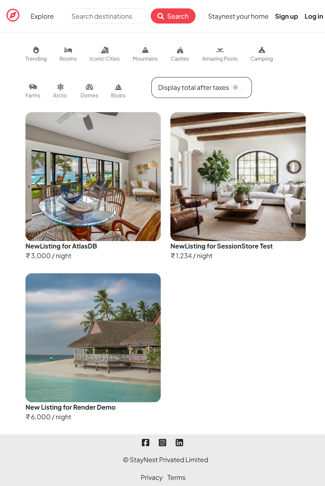
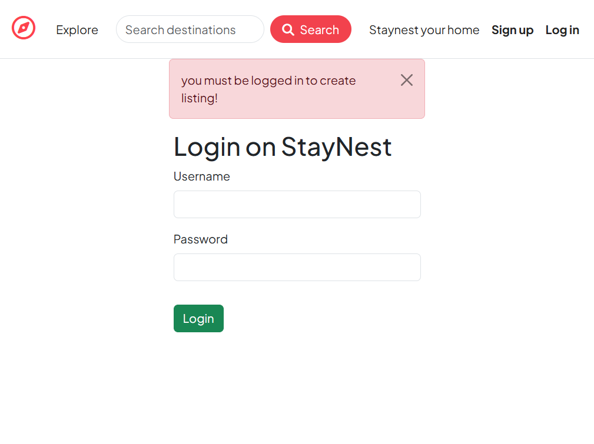
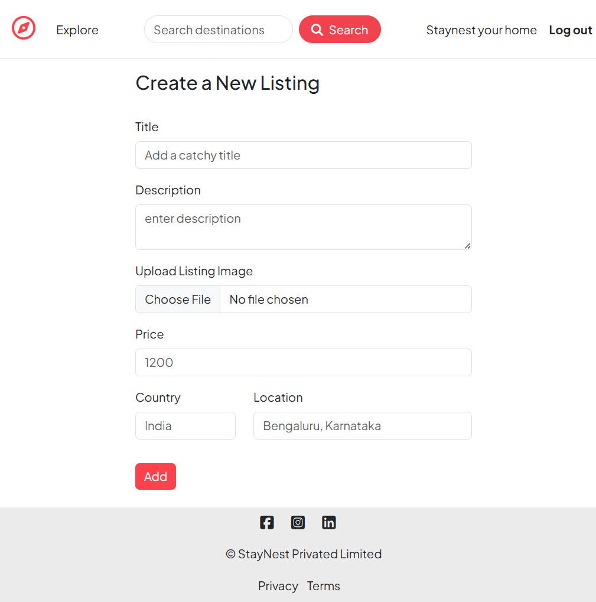

# StayNest — Your Cozy Home Away from Home

StayNest is a polished vacation rental web application built with Node.js and Express. It uses server-rendered EJS views along with HTML, CSS, and client-side JavaScript to deliver a responsive user experience. The project stores listing and user data in MongoDB Atlas and uploads media assets to Cloudinary, while authenticated hosts can manage property listings and guests can browse, review, and interact with individual listings.

## Live Demo

- Render deployment: https://staynest-your-cozy-home-away-from-home.onrender.com/listings

### Screenshots from the live demo







## Key Features

- User authentication and registration with Passport.js and `passport-local-mongoose`
- Persistent session management using `express-session` and `connect-mongo`
- Full CRUD flow for marketplace-style listings
- Image upload and storage via Cloudinary using `multer` + `multer-storage-cloudinary`
- Nested review system tied to listings
- Server-side request validation with Joi
- Flash notifications for success and error states
- Layout-driven EJS rendering with `ejs-mate`

## Technology Stack

- Node.js 25.6.1
- Express 5
- MongoDB Atlas with Mongoose
- Passport.js for authentication
- Cloudinary for image storage
- EJS + EJS Mate for server-side views
- HTML, CSS, and client-side JavaScript for frontend UI
- Joi for validation
- `method-override` for PUT/DELETE form support

## Repository Structure

- `app.js` — primary Express application bootstrap and middleware setup
- `cloudConfig.js` — Cloudinary SDK setup and storage engine
- `routes/` — route definitions for listings, reviews, and users
- `controllers/` — handler functions for routes and business logic
- `models/` — Mongoose schemas for listings, reviews, and users
- `views/` — EJS templates, layouts, and partials
- `public/` — static assets including CSS and frontend JS
- `utils/` — reusable middleware helpers and error wrappers
- `schema.js` — Joi schemas for validating listing and review payloads

## Environment Configuration

Create a `.env` file in the project root with the following values:

```env
ATLASDB_URL=<your-mongodb-connection-string>
SECRET=<your-session-secret>
CLOUD_NAME=<your-cloudinary-cloud-name>
CLOUD_API_KEY=<your-cloudinary-api-key>
CLOUD_API_SECRET=<your-cloudinary-api-secret>
NODE_ENV=development
```

### Recommended values

- `ATLASDB_URL` — MongoDB connection string (Atlas or local)
- `SECRET` — secure session secret for cookies
- `CLOUD_NAME`, `CLOUD_API_KEY`, `CLOUD_API_SECRET` — Cloudinary credentials for uploads
- `NODE_ENV` — typically `development` or `production`

## Installation

Install dependencies locally:

```bash
npm install
```

## Local Development

Start the application with:

```bash
node app.js
```

Then visit:

```text
http://localhost:8080
```

## Deployment

This project has been deployed to Render. The production endpoint is:

- https://staynest-your-cozy-home-away-from-home.onrender.com/listings

### Render deployment notes

- Ensure the same environment variables are configured in Render as in `.env`
- The app listens on port `8080`, so configure Render accordingly if needed
- Cloudinary must be connected via the Render dashboard secret environment variables

## Core Routes

### Listings

- `GET /listings` — fetch all listings
- `GET /listings/new` — show new listing form
- `POST /listings` — add a new listing with image upload
- `GET /listings/:id` — view listing details
- `GET /listings/:id/edit` — show listing edit form
- `PUT /listings/:id` — update listing data
- `DELETE /listings/:id` — delete a listing

### Reviews

- `POST /listings/:id/reviews` — create a review for a listing
- `DELETE /listings/:id/reviews/:reviewId` — remove a review

### Authentication

- `GET /signup` — sign up page
- `POST /signup` — register new user
- `GET /login` — login page
- `POST /login` — authenticate user
- `GET /logout` — end user session

## Application Behavior

- Sessions are persisted to MongoDB, allowing users to remain logged in across browser sessions.
- User access is protected so only authenticated users can create or modify listings and reviews.
- Image uploads are handled via Cloudinary and linked to listing documents.
- Server-side validation prevents invalid listing or review submissions.
- Flash notifications communicate validation messages, authentication errors, and action confirmations.

## Notes

- This app currently uses `node app.js` to start the server, but a `start` script may be added to `package.json` for convenience.
- Database, Cloudinary, and session secrets must be provided before launching the app.


